# Enabling VSCode Remote Viewing of PIL img.show

***WARNING*** IT TAKES ABOUT 30 ~ 60 SECONDS TO SEND THE IMAGE

## On Windows Side

-  From: https://sourceforge.net/projects/xming/ install X-server
-  Once server is installed, start the server with `XLaunch`
  1. 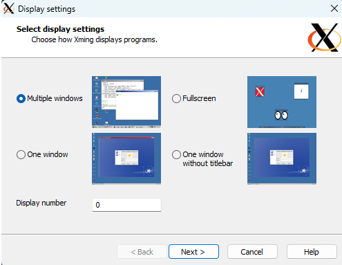
  1. 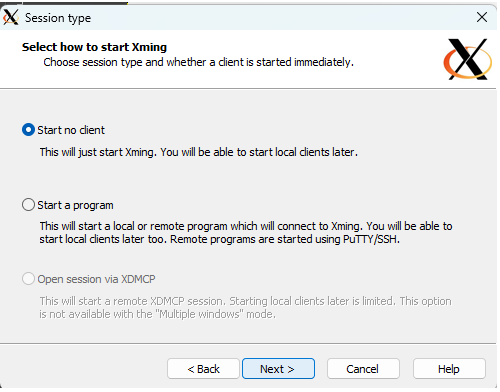
  1. 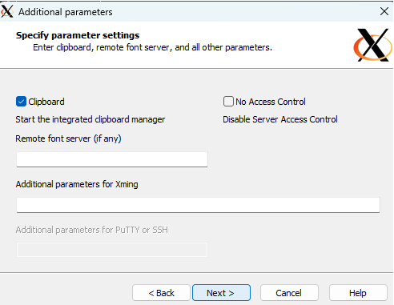
  1. 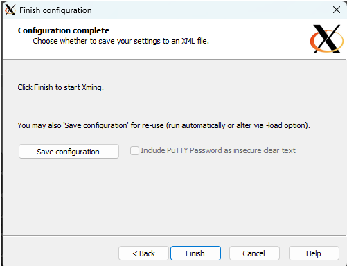
- Find the log file in ***hidden icons***
  1. 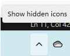
  1. 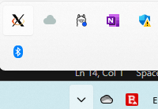
  1. 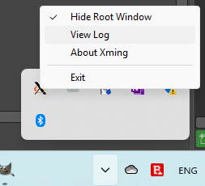
-  Update user environment with `DISPLAY=...` value as seen in the log file  
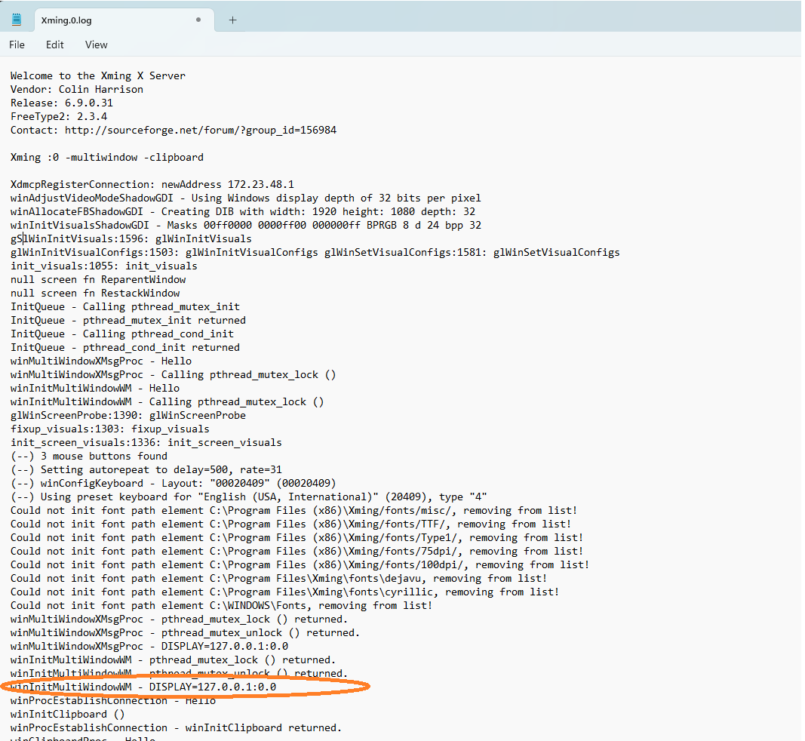
  1. From ***Control Panel*** open *Allow remote access*, select *Advanced* tab, and click on **Environment Variables**:  
  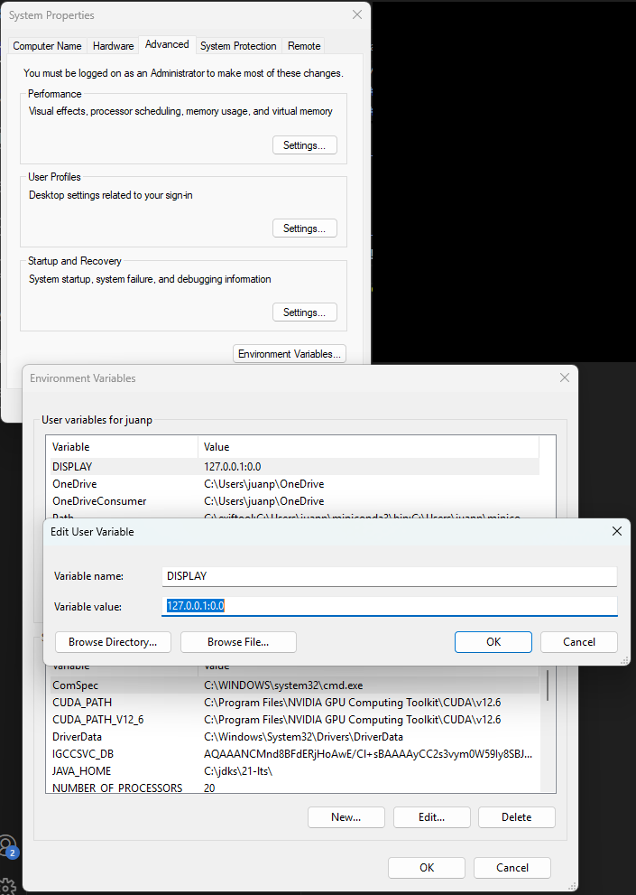
- **Restart Windows** 

## On Linux side (Ubuntu 24)

- `sudo apt update && sudo apt -y upgrade`
- `sudo apt install libpng-dev libjpeg-dev libtiff-dev`
- `sudo apt install imagemagick`
- `convert --version`  
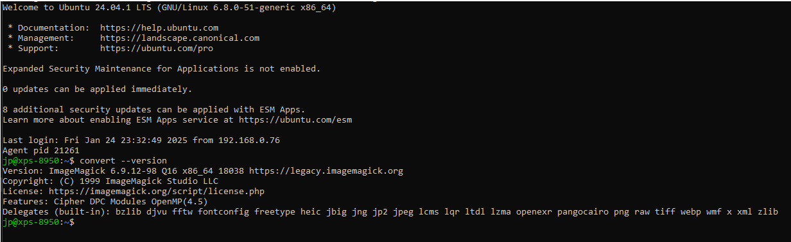
- `sudo vi /etc/ssh/sshd_config`
  - Uncomment `X11Forwarding yes`, or if the line is not there add it to the end of the file.
- `sudo reboot now`

## On VSCode configuration

- 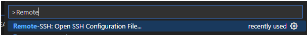
- 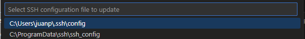
- 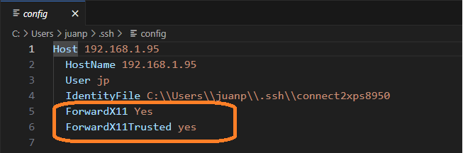
- Close all instances of VSCode
- Reopen VSCode